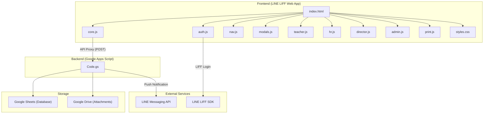
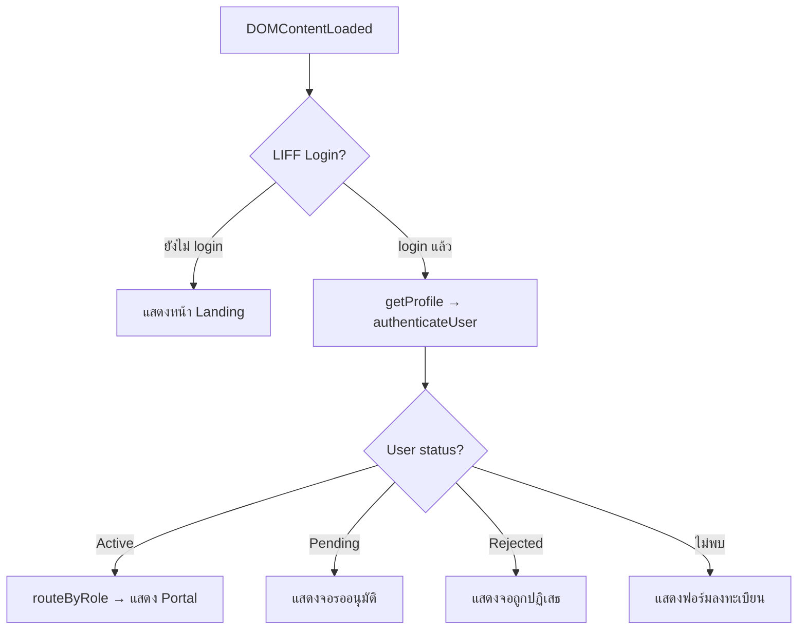
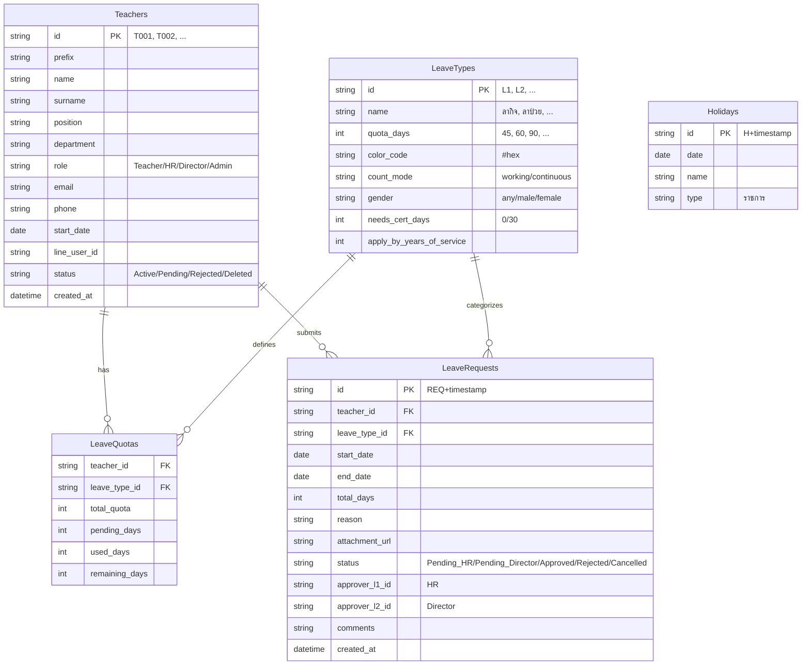
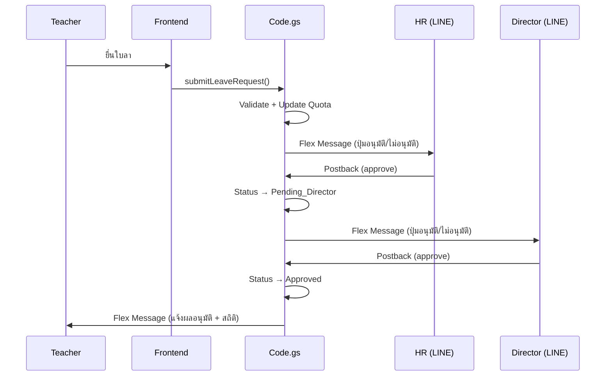

# 📋 สรุปโครงสร้างโปรเจกต์ — ระบบจัดการการลาอิเล็กทรอนิกส์

> โรงเรียนบ้านห้วยตาด · สำนักงานคณะกรรมการการศึกษาขั้นพื้นฐาน (สพฐ.)

---

## 🏗️ ภาพรวมสถาปัตยกรรม



### Technology Stack

| เทคโนโลยี | รายละเอียด |
|-----------|-----------|
| **Frontend** | Vanilla HTML + CSS + JavaScript (ไม่มี Framework) |
| **Backend** | Google Apps Script (GAS) ทำงานเป็น Web App |
| **Database** | Google Sheets (5 ชีต) |
| **File Storage** | Google Drive |
| **Authentication** | LINE LIFF SDK + Admin username/password |
| **Notification** | LINE Messaging API (Flex Messages) |
| **UI Libraries** | SweetAlert2, Google Fonts (Sarabun) |
| **Deployment** | LINE LIFF → GAS Web App URL |

---

## 📂 รายละเอียดไฟล์ทั้งหมด

### 1. [Code.gs](file:///c:/Users/Palanuw4t/Documents/School%20Leave%20Management%20System/Code.gs) — Backend (Google Apps Script)

> **ขนาด:** 1,416 บรรทัด · **หน้าที่:** เป็น Backend ทั้งหมดของระบบ ทำงานบน Google Apps Script

#### โครงสร้างภายในแบ่งเป็น 8 ส่วนหลัก:

---

##### 1.1 Config & Entry Points (บรรทัด 1-97)

| ฟังก์ชัน | หน้าที่ |
|---------|--------|
| `CONFIG` | ค่าตั้งต้นทั้งหมด: `SPREADSHEET_ID`, `LINE_CHANNEL_ACCESS_TOKEN`, `DRIVE_FOLDER_ID`, `LIFF_ID` |
| `getSpreadsheet()` | ดึง Spreadsheet ที่ใช้เป็น DB |
| `doGet(e)` | รับ HTTP GET → ตอบสถานะ API (health check) |
| `doPost(e)` | **Entry point หลัก** — รับ HTTP POST ทั้งจาก LINE Webhook และ Frontend API (RPC pattern) |

> [!IMPORTANT]
> `doPost()` ทำงาน 2 หน้าที่:
> 1. **LINE Webhook** — รับ postback events (approve/reject จากกดปุ่มใน LINE)
> 2. **Frontend RPC** — รับ `{ action, args }` จาก frontend แล้วเรียกฟังก์ชันตาม whitelist

##### 1.2 Database Setup (บรรทัด 99-135)

| ฟังก์ชัน | หน้าที่ |
|---------|--------|
| `setupDatabase()` | สร้าง 5 ชีตพร้อม headers + seed ข้อมูลประเภทการลาเริ่มต้น (OBEC policy) |

**ชีตที่สร้าง:**

| ชีต | คอลัมน์ | คำอธิบาย |
|-----|---------|---------|
| `Teachers` | id, prefix, name, surname, position, department, role, email, phone, start_date, line_user_id, status, created_at | ข้อมูลครูและบุคลากร |
| `LeaveTypes` | id, name, quota_days, color_code, count_mode, gender, needs_cert_days, apply_by_years_of_service | ประเภทการลา (ลากิจ, ลาป่วย, ลาคลอด ฯลฯ) |
| `LeaveQuotas` | teacher_id, leave_type_id, total_quota, pending_days, used_days, remaining_days | โควตาการลาของแต่ละคน |
| `LeaveRequests` | id, teacher_id, leave_type_id, start_date, end_date, total_days, reason, attachment_url, status, approver_l1_id, approver_l2_id, comments, created_at | คำขอลาทั้งหมด |
| `Holidays` | id, date, name, type | วันหยุดราชการ/วันหยุดโรงเรียน |

##### 1.3 Teacher / Auth Functions (บรรทัด 140-242)

| ฟังก์ชัน | หน้าที่ |
|---------|--------|
| `getTeacherByLineId(lineUserId)` | ค้นหาครูจาก LINE User ID (ใช้ตอน login) |
| `registerTeacher(dataObj)` | ลงทะเบียนครูใหม่ (สถานะ = Pending, รอ Admin อนุมัติ) |
| `adminLogin(username, password)` | เข้าสู่ระบบ Admin ด้วย username/password (แยกจาก LINE) |
| `setAdminCredentials()` | ตั้ง admin credentials ใน Script Properties |
| `configureAdmin()` | Wrapper เพื่อ run `setAdminCredentials()` จาก Editor |

##### 1.4 Leave Business Logic (บรรทัด 243-549)

| ฟังก์ชัน | หน้าที่ |
|---------|--------|
| `initQuotasForUser(teacherId)` | สร้างโควตาเริ่มต้นให้ผู้ใช้ใหม่จากทุกประเภทการลา |
| `getLeaveQuotas(teacherId)` | ดึงโควตาการลาของครู (join กับ LeaveTypes) |
| `getLeaveTypes()` | ดึงประเภทการลาทั้งหมด |
| `getLeaveHistory(teacherId)` | ดึงประวัติการลาของครู (เรียงใหม่สุดก่อน) |
| `submitLeaveRequest(data)` | **ส่งคำขอลา** — ตรวจสอบเพศ, นับวันลา, ตรวจโควตา, อัปโหลดไฟล์, แจ้ง HR ผ่าน LINE |
| `cancelLeaveRequest(reqId)` | ยกเลิกคำขอลา (คืนโควตา) |
| `updateLeaveStatusAPI(...)` | **เปลี่ยนสถานะ** — HR อนุมัติ → Pending_Director, Director อนุมัติ → Approved |
| `getPendingRequestsForApprover(...)` | ดึงคำขอที่รอผู้อนุมัติ (แยกตาม role) |

> [!IMPORTANT]
> **Approval Flow (ขั้นตอนอนุมัติ):**
> ```
> ครูยื่นใบลา → Pending_HR → HR อนุมัติ → Pending_Director → Director อนุมัติ → Approved
>                           → HR ไม่อนุมัติ → Rejected
>                                            → Director ไม่อนุมัติ → Rejected
> ```

##### 1.5 HR / Director / Admin Endpoints (บรรทัด 551-840)

| ฟังก์ชัน | หน้าที่ |
|---------|--------|
| `getAllLeaveReport()` | ดึงข้อมูลการลาทั้งหมด (join teacher + type) สำหรับรายงาน |
| `createLeaveOnBehalf(data)` | HR สร้างใบลาแทนครู (auto-approved) |
| `getAllTeachers()` | ดึงครูทุกคน (Active เท่านั้น) |
| `getPendingUsers()` | ดึงผู้ใช้ที่รออนุมัติ |
| `approveUser(id, role)` | Admin อนุมัติผู้ใช้ + กำหนด role + สร้างโควตา |
| `rejectUser(id)` | Admin ปฏิเสธผู้ใช้ |
| `saveTeacher(obj)` | สร้าง/แก้ไขข้อมูลครู (CRUD) |
| `deleteTeacher(id)` | Soft delete ครู (เปลี่ยนสถานะเป็น Deleted) |
| `updateLeaveTypeQuota(typeId, quotaDays)` | แก้ไขโควตาประเภทการลา |
| `getHolidays()` / `saveHoliday()` / `deleteHoliday()` | CRUD วันหยุด |
| `getSignatories()` | ดึงชื่อผู้ลงนาม (Director + HR) สำหรับใบลา |
| `yearlyReset()` | รีเซ็ตโควตาทั้งหมดกลับเป็นศูนย์ (ยกยอดข้ามปีงบประมาณ) |

##### 1.6 Helper / Utility Functions (บรรทัด 842-918)

| ฟังก์ชัน | หน้าที่ |
|---------|--------|
| `currentFiscalYear()` | คำนวณปีงบประมาณปัจจุบัน (พ.ศ.) |
| `fiscalYearRange(ty)` | แปลงปีงบประมาณเป็น date range (1 ต.ค. - 30 ก.ย.) |
| `countLeavesThisFiscalYear(...)` | นับจำนวนครั้งที่ลาในปีงบประมาณ |
| `applyQuotaDelta(...)` | ปรับโควตาด้วย delta (pending, used, remaining) |
| `countLeaveDays(start, end, mode)` | นับวันลา — `working` = เว้นเสาร์อาทิตย์+วันหยุด, `continuous` = รวมวันหยุด |
| `calendarDays(start, end)` | นับวันปฏิทิน (สำหรับตรวจใบรับรองแพทย์) |
| `formatISODate(d)` | แปลงวันที่เป็น ISO format (yyyy-MM-dd) |
| `arrayToObject(headers, row)` | แปลง array → object ด้วย headers |
| `getTeacherById(teacherId)` | ค้นหาครูจาก ID |

##### 1.7 Upload Utilities (บรรทัด 920-953)

| ฟังก์ชัน | หน้าที่ |
|---------|--------|
| `uploadProfilePhoto(userId, base64, folderId)` | อัปโหลดรูปโปรไฟล์ไป Drive |
| `uploadFileToDrive(base64, filename)` | อัปโหลดไฟล์แนบ (ใบรับรองแพทย์) ไป Drive |

##### 1.8 LINE Notifications (บรรทัด 955-1391)

| ฟังก์ชัน | หน้าที่ |
|---------|--------|
| `formatThaiDate()` / `formatThaiDateTime()` | แปลงวันที่เป็นรูปแบบไทย |
| `notifyApprover(reqId, reqData, targetRole)` | **ส่ง Flex Message ไปหา HR/Director** — แสดงข้อมูลใบลาพร้อมปุ่มอนุมัติ/ไม่อนุมัติ |
| `notifyTeacherStatusChange(teacherId, status, ...)` | **ส่ง Flex Message แจ้งผลให้ครู** — อนุมัติ/ไม่อนุมัติ พร้อมสถิติการลา |
| `sendLineMessage(to, messages)` | ส่งข้อความผ่าน LINE Push API |
| `setupRemindTrigger()` | ตั้ง Cron Trigger (ทุกวัน 09:00) |
| `cronDailyReminders()` | แจ้งเตือนคำขอที่ค้างเกิน 2 วัน |

> [!NOTE]
> LINE Flex Messages ออกแบบแบบ Rich Card มีอวาตาร์, สถิติการลา, ปุ่ม approve/reject, ลำดับการอนุมัติ

---

### 2. [index.html](file:///c:/Users/Palanuw4t/Documents/School%20Leave%20Management%20System/index.html) — HTML หลัก

> **ขนาด:** 122 บรรทัด · **หน้าที่:** โครงสร้าง HTML หลักและ mount points สำหรับ views ทั้งหมด

| ส่วน | รายละเอียด |
|------|-----------|
| `#loader` | Fullscreen loading spinner |
| `#view-landing` | หน้า Login (ปุ่ม LINE Login + Admin Login) |
| `#view-onboarding` | ฟอร์มลงทะเบียนครูใหม่ |
| `#view-teacher` | Mount point สำหรับ Teacher Portal (render โดย `teacher.js`) |
| `#view-hr` | Mount point สำหรับ HR Portal (render โดย `hr.js`) |
| `#view-director` | Mount point สำหรับ Director Portal (render โดย `director.js`) |
| `#view-admin` | Mount point สำหรับ Admin Portal (render โดย `admin.js`) |
| `#modal-root` | Container สำหรับ modals ทั้งหมด |
| `#toast-root` | Container สำหรับ toast notifications |

**ลำดับ Script Loading:**
```
core.js → print.js → nav.js → modals.js → teacher.js → director.js → hr.js → admin.js → auth.js
```

> [!WARNING]
> ลำดับ script มีความสำคัญ: `auth.js` ต้องโหลดสุดท้ายเพราะเป็นตัว boot ระบบ (DOMContentLoaded listener)

---

### 3. [core.js](file:///c:/Users/Palanuw4t/Documents/School%20Leave%20Management%20System/core.js) — Config, Constants, Utils, API Proxy

> **ขนาด:** 206 บรรทัด · **หน้าที่:** เป็น foundation ของ frontend ทั้งหมด

| กลุ่ม | รายละเอียด |
|------|-----------|
| **Config** | `LIFF_ID`, `GAS_WEB_APP_URL`, `SCHOOL_LOGO_URL` |
| **Global State** | `currentUser`, `currentLineProfile`, `leaveTypes`, `_holidays`, `calendarState`, `hrFilters`, `hrSort` |
| **Constants** | `THAI_MONTHS`, `WEEKDAYS`, `AVATAR_COLORS`, `PREFIXES`, `ROLE_META` |
| **Date Helpers** | `normDate()`, `parseISO()`, `fmtThai()`, `daysBetween()`, `toISO()`, `todayISO()` |
| **UI Utils** | `showLoader()`, `toast()`, `swalError()`, `esc()` (XSS protection) |
| **SVG Icons** | `ICONS` object + `svg()` helper (Feather-style inline SVGs) |
| **Thai Date Picker** | `thaiDate()` + `syncThaiDate()` — Dropdown แบบ วัน/เดือน(ไทย)/ปี พ.ศ. |
| **Range Calendar** | `rangeCalendar()` + `pickRangeDay()` — Mini calendar สำหรับเลือกช่วงวันลา |
| **API Proxy** | `api` — JavaScript Proxy ที่แปลงการเรียก method เป็น POST request ไป GAS |

> [!TIP]
> **API Proxy** ใช้ `text/plain` Content-Type เพื่อหลีกเลี่ยง CORS preflight ของ GAS:
> ```javascript
> const api = new Proxy({}, { get: (_t, funcName) => async (...args) => { ... } });
> // ใช้: await api.submitLeaveRequest(data) → POST { action: 'submitLeaveRequest', args: [data] }
> ```

---

### 4. [auth.js](file:///c:/Users/Palanuw4t/Documents/School%20Leave%20Management%20System/auth.js) — Boot, Login, Routing

> **ขนาด:** 173 บรรทัด · **หน้าที่:** จุดเริ่มต้นระบบ, Authentication, และ Routing ตาม Role

| ฟังก์ชัน | หน้าที่ |
|---------|--------|
| `DOMContentLoaded handler` | **Boot sequence** — init LIFF → ตรวจ login → authenticate → route |
| `handleLogin()` | เรียก `liff.login()` |
| `openAdminLogin()` | เปิด modal login สำหรับ Admin (username/password) |
| `authenticateUser(lineUserId)` | ค้นหา user จาก LINE ID → Active = เข้าระบบ, Pending = แสดงจอรอ, null = ลงทะเบียน |
| `showStatusScreen(kind, user)` | แสดงจอ "รออนุมัติ" หรือ "ถูกปฏิเสธ" |
| `prefixSelectHtml()` / `getPrefix()` | สร้าง `<select>` คำนำหน้า (นาย/นาง/นางสาว/อื่นๆ) |
| `showView(id)` | สลับ view (ซ่อน/แสดง `.view-section`) |
| `routeByRole()` | **Router หลัก** — โหลด leaveTypes + holidays → เรียก `reloadPortal()` |
| `reloadPortal()` | เรียกฟังก์ชัน render ตาม role (Teacher/HR/Director/Admin) |
| `logout()` | Logout + refresh page |

**Auth Flow:**


---

### 5. [nav.js](file:///c:/Users/Palanuw4t/Documents/School%20Leave%20Management%20System/nav.js) — Sidebar Navigation

> **ขนาด:** 48 บรรทัด · **หน้าที่:** Sidebar + Tab navigation สำหรับ HR / Director / Admin portals

| ฟังก์ชัน | หน้าที่ |
|---------|--------|
| `setTab(role, idx)` | เปลี่ยน tab → เรียก render ของ role นั้น |
| `sidebar(role, badges)` | สร้าง HTML ของ sidebar — logo, menu items, ปุ่มยื่นใบลา, ชื่อผู้ใช้, logout |

**เมนูตาม Role:**

| Role | เมนู |
|------|------|
| **HR** | ภาพรวม · รออนุมัติ · รายงานการลา · บุคลากร |
| **Director** | รออนุมัติ · ปฏิทินโรงเรียน |
| **Admin** | ผู้ใช้งาน · ประเภทการลา · วันหยุด · ผู้ลงนาม · อันตราย |

---

### 6. [modals.js](file:///c:/Users/Palanuw4t/Documents/School%20Leave%20Management%20System/modals.js) — Shared Modal + Leave Form

> **ขนาด:** 130 บรรทัด · **หน้าที่:** Modal infrastructure และฟอร์มยื่นใบลา

| ฟังก์ชัน | หน้าที่ |
|---------|--------|
| `closeModal()` | ปิด modal (clear `#modal-root`) |
| `overlay(inner, align)` | สร้าง modal overlay พร้อม backdrop |
| `openLeaveForm()` | **ฟอร์มยื่นใบลา** — เลือกประเภท, เลือกวันด้วย range calendar, เหตุผล, แนบไฟล์ |
| `countDaysClient(from, to, mode)` | นับวันลาฝั่ง client (เหมือน server แต่ใช้ `_holidays` ที่โหลดมาแล้ว) |
| `calcLeaveDays()` | คำนวณวันลาแบบ realtime เมื่อเปลี่ยนวัน/ประเภท |
| `submitLeaveForm()` | **ส่งฟอร์ม** — validate → confirm (SweetAlert) → เรียก API → reload |
| `cancelRequest(reqId)` | ยกเลิกคำขอลา (confirm + เรียก API) |
| `toBase64(file)` | แปลง File → Base64 (สำหรับอัปโหลดเอกสาร) |

---

### 7. [teacher.js](file:///c:/Users/Palanuw4t/Documents/School%20Leave%20Management%20System/teacher.js) — Teacher Portal

> **ขนาด:** 710 บรรทัด · **หน้าที่:** หน้าหลักสำหรับครู (Mobile-first design, max-width 430px)

**มี 3 แท็บ:**

| แท็บ | ID | หน้าที่ |
|------|-----|--------|
| **หน้าหลัก** | `tt-home` | Dashboard — โปรไฟล์, โควตาการลา (วงกลม), ประวัติการลาล่าสุด, ปุ่มยื่นลา |
| **ปฏิทินการลา** | `tt-calendar` | Mini calendar แสดงจุดสีตามประเภทการลา + รายการลา (filter ได้) |
| **สถิติการลา** | `tt-stats` | Dashboard — Donut chart, Bar chart รายเดือน, ตารางสรุป, สิทธิ์การลา |

| ฟังก์ชัน | หน้าที่ |
|---------|--------|
| `loadTeacher()` | โหลด quotas + history จาก API |
| `renderTeacher()` | **Render หน้าหลัก** — avatar, quota cards (ring chart), ประวัติ, FAB |
| `renderCalendarTab()` | Render ปฏิทิน + รายการลา |
| `renderStatsTab()` | Render สถิติ + charts |
| `openNotifications()` | เปิด notification panel (dropdown จากกระดิ่ง) |
| `switchTeacherTab(tab)` | สลับแท็บ (Home/Calendar/Stats) |
| `makeRecordCard(r)` | สร้าง card ของรายการลา (แสดงสถานะ, เหตุผล, ปุ่มยกเลิก/ออกใบลา) |

> [!NOTE]
> Teacher Portal ออกแบบ Mobile-first สำหรับ LINE LIFF — กว้างสูงสุด 430px, มี Bottom Navigation + FAB (Floating Action Button)

---

### 8. [director.js](file:///c:/Users/Palanuw4t/Documents/School%20Leave%20Management%20System/director.js) — Director Portal

> **ขนาด:** 137 บรรทัด · **หน้าที่:** หน้าสำหรับผู้อำนวยการ (Desktop sidebar layout)

**มี 2 แท็บ:**

| แท็บ | หน้าที่ |
|------|--------|
| **รออนุมัติ** | แสดง approval cards ของคำขอที่ HR ตรวจสอบแล้ว (Pending_Director) |
| **ปฏิทินโรงเรียน** | ปฏิทินรายเดือนแสดงใครลาวันไหน + วันหยุดราชการ |

| ฟังก์ชัน | หน้าที่ |
|---------|--------|
| `loadDirector()` | โหลด pending + records + holidays |
| `renderDirector()` | Render layout (sidebar + content) |
| `approvalCard(r)` | **Shared กับ HR** — แสดงข้อมูลคำขอ + ช่องหมายเหตุ + ปุ่มอนุมัติ/ไม่อนุมัติ |
| `renderCalendar(records, holidays)` | Render school calendar (แสดงจำนวนคนลาแต่ละวัน) |
| `decideRequest(reqId, action)` | อนุมัติ/ปฏิเสธคำขอ (เรียก API → reload) |

---

### 9. [hr.js](file:///c:/Users/Palanuw4t/Documents/School%20Leave%20Management%20System/hr.js) — HR Portal

> **ขนาด:** 216 บรรทัด · **หน้าที่:** หน้าสำหรับฝ่ายบุคคล (Desktop sidebar layout)

**มี 4 แท็บ:**

| แท็บ | หน้าที่ |
|------|--------|
| **ภาพรวม** | Dashboard — 4 metric cards (ลาวันนี้/รออนุมัติ/อนุมัติเดือนนี้/บุคลากร) + ใครลาวันนี้ |
| **รออนุมัติ** | Approval cards (Pending_HR) — ใช้ `approvalCard()` จาก director.js |
| **รายงานการลา** | ตารางรายงานพร้อม filter (วันที่/กลุ่มสาระ/ประเภทลา) + sort + Export CSV |
| **บุคลากร** | รายชื่อบุคลากร + ปุ่มสร้างใบลาแทน |

| ฟังก์ชัน | หน้าที่ |
|---------|--------|
| `loadHr()` | โหลด records + teachers + pending จาก API |
| `renderHr()` | Render layout (sidebar + content) ตาม tab ที่เลือก |
| `setHrFilter(k, v)` | ตั้งค่า filter → re-render |
| `sortHr(field)` | เรียงลำดับรายงาน (ชื่อ/วันที่) |
| `exportCsv()` | **Export CSV** — สร้างไฟล์ CSV ของรายงานการลาทั้งหมด |
| `openOnBehalf()` | **Modal สร้างใบลาแทน** — เลือกครู + ประเภท + วัน + เหตุผล |
| `submitOnBehalf()` | ส่งข้อมูลใบลาแทน (auto-approved) |

---

### 10. [admin.js](file:///c:/Users/Palanuw4t/Documents/School%20Leave%20Management%20System/admin.js) — Admin Portal

> **ขนาด:** 266 บรรทัด · **หน้าที่:** หน้าสำหรับผู้ดูแลระบบ (Desktop sidebar layout)

**มี 5 แท็บ:**

| แท็บ | หน้าที่ |
|------|--------|
| **ผู้ใช้งาน** | Metric cards + ตาราง CRUD ผู้ใช้ + อนุมัติ/ปฏิเสธ Pending Users |
| **ประเภทการลา** | แก้ไขโควตา (วัน/ปี) ของแต่ละประเภท |
| **วันหยุด** | CRUD วันหยุดราชการ (Thai date picker + inline edit) |
| **ผู้ลงนาม** | ตั้งชื่อผู้อำนวยการ + ฝ่ายบุคคล สำหรับพิมพ์ในใบลา |
| **อันตราย** | ปุ่มยกยอดวันลาข้ามปีงบประมาณ (reset all quotas) |

| ฟังก์ชัน | หน้าที่ |
|---------|--------|
| `loadAdmin()` | โหลด teachers + holidays + records + pendingUsers |
| `renderAdmin()` | Render layout ตาม tab |
| `approvePendingUser(id)` / `rejectPendingUser(id)` | อนุมัติ/ปฏิเสธผู้ใช้รอการอนุมัติ |
| `openUserModal(id)` | Modal เพิ่ม/แก้ไขผู้ใช้ (prefix, name, position, department, role) |
| `saveUser()` | บันทึกผู้ใช้ (create/update) |
| `removeUser(id)` | ลบผู้ใช้ (soft delete) |
| `setTypeQuota(id, val)` | แก้ไขโควตาประเภทการลา |
| `addHoliday()` / `saveHoliday()` / `deleteHolidayRow()` | CRUD วันหยุด |
| `saveDocConfig()` | บันทึกชื่อผู้ลงนามใน localStorage |
| `confirmYearlyReset()` | ยืนยัน + เรียก `yearlyReset()` |

---

### 11. [print.js](file:///c:/Users/Palanuw4t/Documents/School%20Leave%20Management%20System/print.js) — พิมพ์ใบลา

> **ขนาด:** 137 บรรทัด · **หน้าที่:** สร้างใบลาตามแบบฟอร์มราชการ (พิมพ์/บันทึก PDF)

| ฟังก์ชัน | หน้าที่ |
|---------|--------|
| `SCHOOL_NAME`, `DIRECTOR_NAME`, `PREPARER_NAME` | ค่าคงที่สำหรับใบลา (อ่านจาก localStorage) |
| `leaveKind(name)` | แยกประเภทลา (sick/maternity/personal) จากชื่อ |
| `printLeaveForm(reqId)` | เรียกจาก Teacher Portal |
| `printLeaveFormHr(reqId)` | เรียกจาก HR Portal |
| `buildLeaveFormHtml(rec, teacher, quotas)` | **สร้าง HTML ใบลา** — หัวเรื่อง, ข้อมูลผู้ลา, checkbox ประเภท, วันที่, สถิติ, ลายเซ็น |
| `openPrint(bodyHtml)` | เปิดหน้าต่างใหม่ + auto print |

> [!NOTE]
> ใบลาตามแบบ "แบบใบลาป่วย ลาคลอดบุตร ลากิจส่วนตัว" ของราชการ — มี checkbox ประเภทลา, ตารางสถิติ, ช่องลงนามผู้ตรวจสอบ + ผู้บังคับบัญชา

---

### 12. [styles.css](file:///c:/Users/Palanuw4t/Documents/School%20Leave%20Management%20System/styles.css) — CSS

> **ขนาด:** 86 บรรทัด · **หน้าที่:** Styles พื้นฐานและ Responsive Layout

| Section | รายละเอียด |
|---------|-----------|
| **Base** | Reset, font (Sarabun), selection color, link styles |
| **Animations** | `spin` (loader), `fadeUp` (modal entrance) |
| **Loader** | `.dc-loader`, `.dc-spinner` — Fullscreen loading |
| **Form Helpers** | `.dc-label`, `.dc-input`, `.dc-btn-primary` |
| **Hover/Row** | `.dc-hover` (brightness), `.dc-row` (table row hover) |
| **Scrollbar** | Custom thin scrollbar |
| **Responsive** | 3 breakpoints: ≤900px, ≤720px (sidebar → top bar), ≤420px |

---

## 🔄 User Roles & Permissions

| Role | สิทธิ์ | เข้าสู่ระบบผ่าน |
|------|--------|----------------|
| **Teacher** | ยื่นใบลา, ดูประวัติ, ดูสถิติ, พิมพ์ใบลา | LINE LIFF |
| **HR** | อนุมัติขั้นแรก, ดูรายงาน, Export CSV, สร้างใบลาแทน | LINE LIFF |
| **Director** | อนุมัติขั้นสุดท้าย, ดูปฏิทินโรงเรียน | LINE LIFF |
| **Admin** | จัดการผู้ใช้, โควตา, วันหยุด, ผู้ลงนาม, Reset ข้ามปี | LINE LIFF หรือ Username/Password |

---

## 📊 Database Schema (Google Sheets)



---

## 🔔 LINE Notification Flow



---

## ⚙️ การ Deploy

### ขั้นตอนการ Deploy

1. **สร้าง Google Apps Script Project** → วาง `Code.gs` ทั้งหมด
2. **ตั้งค่า Script Properties** → Run `configureAdmin()` เพื่อตั้ง admin credentials
3. **Deploy เป็น Web App** → Execute as "Me", Access "Anyone"
4. **คัดลอก Web App URL** → ใส่ใน `core.js` (`GAS_WEB_APP_URL`)
5. **สร้าง LINE LIFF App** → ใส่ Web App URL เป็น endpoint
6. **คัดลอก LIFF ID** → ใส่ใน `core.js` (`LIFF_ID`) และ `Code.gs` (`CONFIG.LIFF_ID`)
7. **ตั้งค่า LINE Channel Access Token** → ใส่ใน `Code.gs` (`CONFIG.LINE_CHANNEL_ACCESS_TOKEN`)
8. **ตั้งค่า Webhook URL** → ชี้ไปที่ GAS Web App URL
9. **Run `setupDatabase()`** → สร้าง Sheets + seed ข้อมูลเริ่มต้น

### ค่า Config ที่ต้องเปลี่ยน

| ไฟล์ | ตัวแปร | ค่า |
|------|--------|-----|
| `Code.gs` | `CONFIG.LINE_CHANNEL_ACCESS_TOKEN` | LINE Channel Access Token |
| `Code.gs` | `CONFIG.DRIVE_FOLDER_ID` | Google Drive Folder ID สำหรับเก็บไฟล์แนบ |
| `Code.gs` | `CONFIG.LIFF_ID` | LINE LIFF ID |
| `core.js` | `GAS_WEB_APP_URL` | URL ของ GAS Web App ที่ deploy แล้ว |
| `core.js` | `LIFF_ID` | LINE LIFF ID (ต้องตรงกับ Code.gs) |
| `core.js` | `SCHOOL_LOGO_URL` | URL โลโก้โรงเรียน |

---

## 🗺️ สิ่งที่ควรรู้ก่อนพัฒนาต่อ

> [!CAUTION]
> **ข้อจำกัดที่สำคัญ:**
> - GAS มี execution time limit 6 นาที / request
> - Google Sheets ไม่ใช่ database จริง — ไม่มี index, transaction isolation ไม่สมบูรณ์ (ใช้ `LockService` แก้บางส่วน)
> - `doPost()` ใช้ whitelist เพื่อป้องกัน — ฟังก์ชันใหม่ต้องเพิ่มใน `allowedActions` array
> - ทุกครั้งที่แก้ `Code.gs` ต้อง **Deploy ใหม่** (New Deployment) ถึงจะมีผล

> [!TIP]
> **Best Practices สำหรับการพัฒนา:**
> - แก้ Frontend (JS/HTML/CSS) → อัปไฟล์ที่ host (ถ้าเป็น LIFF endpoint) → เพิ่ม `?v=` version
> - แก้ Backend (Code.gs) → Deploy เป็น New Version → อัป URL ใน `core.js` (ถ้า URL เปลี่ยน)
> - ทดสอบ API → เปิด Script Editor → ใช้ `Logger.log()` + View Logs
> - ทดสอบ LINE Notification → ใช้ LINE Official Account Manager ดู log
